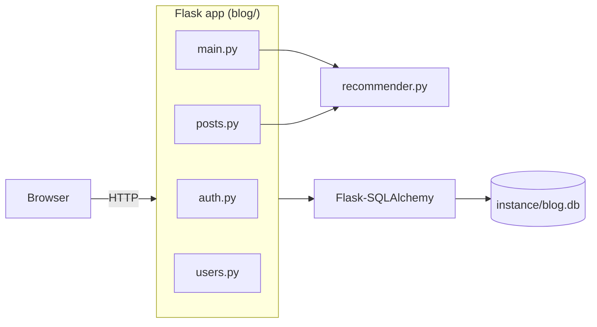
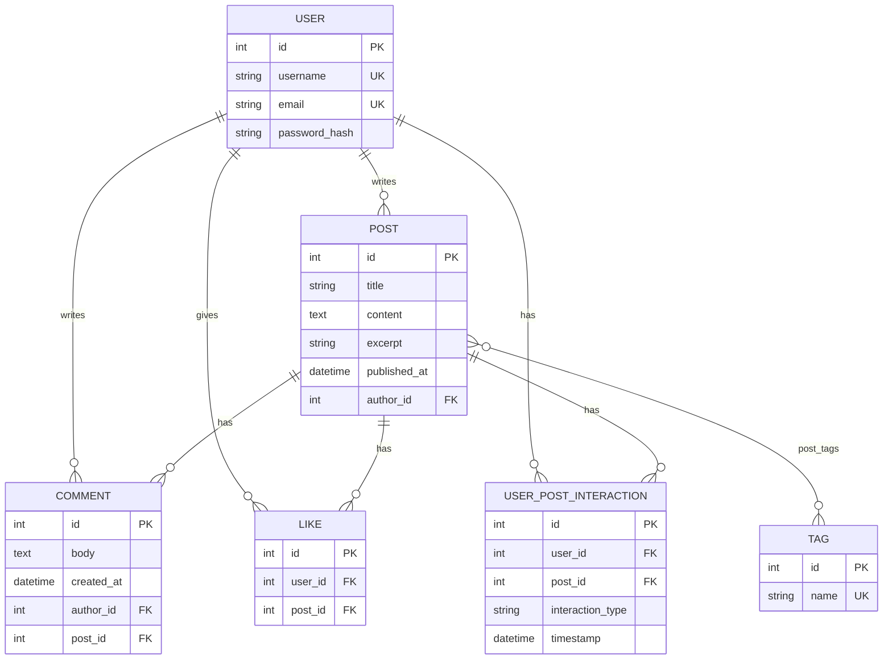

# Архітектура

Re:Action — класичний серверний Flask-застосунок: HTML рендериться на сервері шаблонами Jinja2, JavaScript використовується лише для редактора, тегів і перемикання теми.

## Компоненти

- **`app.py`** — створює застосунок через `create_app()`, викликає `db.create_all()` і запускає dev-сервер.
- **`blog/__init__.py`** — application factory: конфігурація (`SECRET_KEY`, `SQLALCHEMY_DATABASE_URI`), ініціалізація розширень (SQLAlchemy, Bcrypt, LoginManager), реєстрація blueprints і Jinja-фільтра `markdown`.
- **`recommender.py`** — чисті функції без стану; модель TF-IDF будується заново на кожен виклик (див. [RECOMMENDER.md](RECOMMENDER.md)).

## Маршрути

| Метод | URL | Blueprint / функція | Авторизація | Опис |
|---|---|---|---|---|
| GET | `/` | `main.home` | — | стрічка; `?feed=latest\|recommended`, `?page=N` |
| GET | `/search?q=` | `main.search` | — | пошук по заголовку, тексту, автору, тегу |
| GET, POST | `/register` | `auth.register` | — | реєстрація |
| GET, POST | `/login` | `auth.login` | — | вхід |
| GET | `/logout` | `auth.logout` | — | вихід |
| GET, POST | `/post/new` | `posts.create_post` | ✔ | нова стаття |
| GET | `/post/<id>` | `posts.post` | — | стаття + схожі статті; фіксує перегляд |
| GET, POST | `/post/<id>/edit` | `posts.edit_post` | автор | редагування |
| POST | `/post/<id>/delete` | `posts.delete_post` | автор | видалення |
| GET | `/tag/<name>` | `posts.posts_by_tag` | — | статті за тегом |
| POST | `/post/<id>/comment` | `posts.add_comment` | ✔ | новий коментар |
| POST | `/comment/<id>/edit` | `posts.edit_comment` | автор | редагування коментаря |
| POST | `/comment/<id>/delete` | `posts.delete_comment` | автор | видалення коментаря |
| POST | `/like/<id>` | `posts.like_action` | ✔ | поставити / зняти лайк |
| GET | `/user/<username>` | `users.profile` | — | профіль користувача |

«✔» — потрібен вхід (`@login_required`); «автор» — додатково перевіряється, що поточний користувач є автором (інакше `403`).

## Модель даних

- **`UserPostInteraction`** — історія поведінки для рекомендацій. `interaction_type` приймає значення `view` (записується при першому відкритті статті) або `like` (при першому лайку). Для пари користувач–стаття зберігається не більше одного запису кожного типу.
- **`Like`** — поточний стан лайка (запис додається і видаляється при перемиканні). Окремо від історії взаємодій.
- Видалення статті каскадно видаляє її коментарі, лайки та взаємодії.
- Теги нормалізуються до нижнього регістру й створюються автоматично при збереженні статті. Tagify надсилає їх як JSON `[{"value": "..."}]`.

## Frontend

- `base.html` — загальний макет: навбар з пошуком, flash-повідомлення, перемикач теми (тема зберігається в `localStorage`, застосовується через `data-bs-theme`).
- `create_post.html` / `edit_post.html` — SimpleMDE для тексту і Tagify для тегів (зі списком наявних тегів для автодоповнення); окремі стилі для SimpleMDE і Tagify в темній темі.
- Усі зовнішні бібліотеки підключаються з CDN (jsDelivr, unpkg) — для роботи потрібен інтернет.
